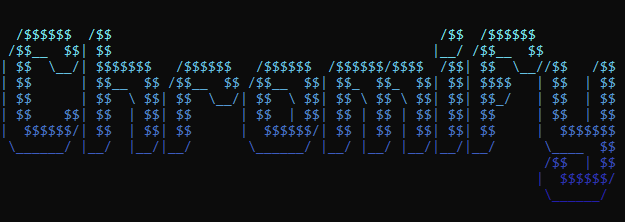

# Chromify - Documentación de la biblioteca de Python

Chromify es una biblioteca de Python que proporciona funcionalidades para la manipulación y conversión de colores. Te permite convertir entre diferentes representaciones de color como RGB, HEX, HSL, CMYK y HSV, y realizar diversas operaciones con colores.



         


# Tabla de contenidos
- [Chromify - Documentación de la biblioteca de Python](#chromify---documentación-de-la-biblioteca-de-python)
  * [Tabla de contenidos](#tabla-de-contenidos)
  * [Instalación](#instalación)
  * [Uso](#uso)
    + [Clase `Color`](#clase-color)
    + [Creación de un objeto `Color`](#creación-de-un-objeto-color)
  * [Conversión de colores](#conversión-de-colores)
  * [Manipulación de colores](#manipulación-de-colores)
  * [Clase `Converter`](#clase-converter)
    + [Creación de un objeto `Converter`](#creación-de-un-objeto-converter)
  * [Conversión de colores](#conversión-de-colores-1)
  * [Degradados de colores](#degradados-de-colores)
  * [Pasos de color](#pasos-de-color)
     + [Valores de retorno de los pasos de color](#valores-de-retorno-de-los-pasos-de-color)
  * [Licencia](#licencia)
  * [Agradecimientos especiales](#agradecimientos-especiales)

## Instalación

Puedes instalar Chromify usando pip: `pip install chromify`


## Uso

### Clase `Color`

La clase `Color` representa un color y proporciona métodos para la conversión y manipulación de colores.

### Creación de un objeto `Color`

Puedes crear un objeto `Color` de las siguientes formas:

```python
from chromify import Color

# Crear un objeto Color a partir de una representación CSS
color1 = Color("#FF0000")
color2 = Color("rgb(255, 0, 0)")
color3 = Color("hsl(0, 100%, 50%)")

# Crear un objeto Color a partir de valores RGB
color4 = Color(255, 0, 0)

# Crear un objeto Color a partir de otro objeto Color
color5 = Color(color1)
```

# Conversión de colores

Puedes convertir un objeto Color a diferentes representaciones utilizando los siguientes métodos:

```python
# Convertir a representación HEX
valor_hex = color1.to_hex()  # Retorna "#FF0000"

# Convertir a representación HSL
valor_hsl = color1.to_hsl()  # Retorna "hsl(0, 100%, 50%)"

# Convertir a representación CMYK
valor_cmyk = color1.to_cmyk()  # Retorna "cmyk(0%, 100%, 100%, 0%)"

# Convertir a representación HSV
valor_hsv = color1.to_hsv()  # Retorna "hsv(0, 100%, 100%)"

# Convertir a representación CSS (RGB)
valor_css = color1.to_css()  # Retorna "rgb(255, 0, 0)"
```

# Manipulación de colores

La clase Color también proporciona métodos para la manipulación de colores, como invertir el color, calcular el brillo, generar una paleta de colores, entre otros.

```python
# Invertir el color
color_invertido = color1.invert()

# Calcular el brillo del color
brillo = color1.brightness()

# Generar una paleta de colores
paleta = color1.generate_palette(5)
```

# Clase `Converter`

La clase `Converter` es una subclase de Color y agrega funcionalidades adicionales para convertir valores de color entre diferentes representaciones.

### Creación de un objeto `Converter`

Puedes crear un objeto `Converter` de la misma forma que un objeto Color:

```python
from chromify import Converter

# Crear un objeto Converter a partir de una representación CSS
converter1 = Converter("#FF0000")
converter2 = Converter("rgb(255, 0, 0)")
converter3 = Converter("hsl(0, 100%, 50%)")

# Crear un objeto Converter a partir de valores RGB
converter4 = Converter(255, 0, 0)

# Crear un objeto Converter a partir de otro objeto Color
converter5 = Converter(color1)
```

# Conversión de colores

La clase `Converter` proporciona métodos adicionales para convertir valores de color entre diferentes representaciones. Puedes utilizar los siguientes métodos:

```python
# Convertir a representación HEX
valor_hex = converter1.to_hex()  # Retorna "#FF0000"

# Convertir a representación HSL
valor_hsl = converter1.to_hsl()  # Retorna "hsl(0, 100%, 50%)"

# Convertir a representación CMYK
valor_cmyk = converter1.to_cmyk()  # Retorna "cmyk(0%, 100%, 100%, 0%)"

# Convertir a representación HSV
valor_hsv = converter1.to_hsv()  # Retorna "hsv(0, 100%, 100%)"

# Convertir a representación CSS (RGB)
valor_css = converter1.to_css()  # Retorna "rgb(255, 0, 0)"
```

# Degradados de colores
La función `gradient()` te permite crear fácilmente un degradado de colores para el texto de fondo y el texto de primer plano. Retorna una cadena de texto coloreada. Puedes utilizar el siguiente método:

```python
from Chromify import *
init() # Asegúrate de que los colores se puedan mostrar correctamente
# Creación de un color
micolorinicial = Color("#FF0000")
micolorfinal

 = Color(0, 255, 0)
print(gradient(micolorinicial, micolorfinal, "El texto al que quiero aplicar el degradado", background=False)) # establece background en True si quieres colorear el fondo en lugar del texto de primer plano (False es el valor predeterminado)
```

# Pasos de color `steps()`
La función `steps` devuelve una matriz con la longitud de tu elección, con colores ordenados desde 0 hasta la longitud, creando un degradado. Puedes utilizar este método:

```python
from Chromify import *
init() # Asegúrate de que los colores se puedan mostrar correctamente
# Creación de un color
micolorinicial = Color("#FF0000")
micolorfinal = Color(0, 255, 0)
longitud_array = 6
mi_array = steps(micolorinicial, micolorfinal, longitud_array, style="color")
# -> [Color(255, 0, 0), Color(212, 42, 0), Color(170, 85, 0), Color(127, 127, 0), Color(85, 170, 0), Color(42, 212, 0)]
# imprimir el degradado verticalmente
mi_cadena = f"""
{mi_array[0].FORE}#############################
{mi_array[1].fore()}#############################
{color(mi_array[2], background=False)}#############################
{color(mi_array[3].to_hex)}#############################
{mi_array[4].FORE}#############################
{mi_array[5].FORE}#############################
"""
print(mi_cadena)
```

#### Valores de retorno de los pasos de color
`"rgb"`: Retorna la matriz con tuplas RGB compatibles con la clase Color (valor predeterminado).

`"fore_esc"`: Retorna la matriz con cadenas de escape para colorear el texto de primer plano.

`"back_esc"`: Retorna la matriz con cadenas de escape para colorear el fondo.

`"color"`: Retorna la matriz con objetos Color compatibles con la clase Color (valor predeterminado si se proporciona un valor no válido). 

# [Licencia](LICENSE)

MIT License

Copyright (c) 2023 Plaraje

Permission is hereby granted, free of charge, to any person obtaining a copy of this software and associated documentation files (the "Software").

For any sales or inquiry-related questions, please contact Plaraje at mat.demoya@gmail.com.

# Agradecimientos especiales

Agradecimientos a Sk1x por su ayuda con la licencia y la documentación.
